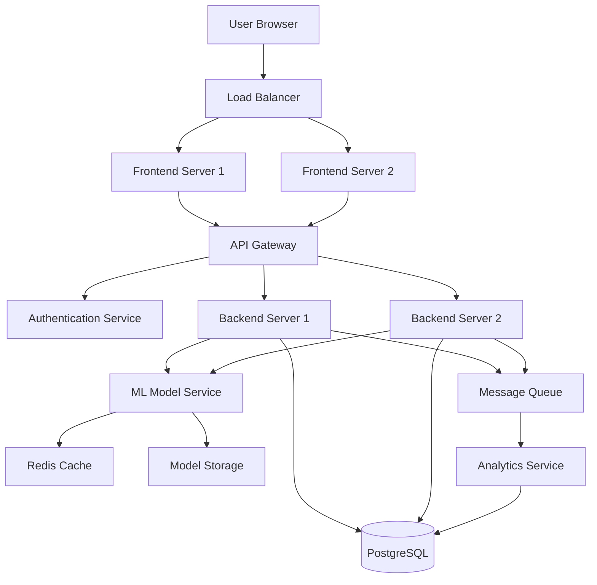
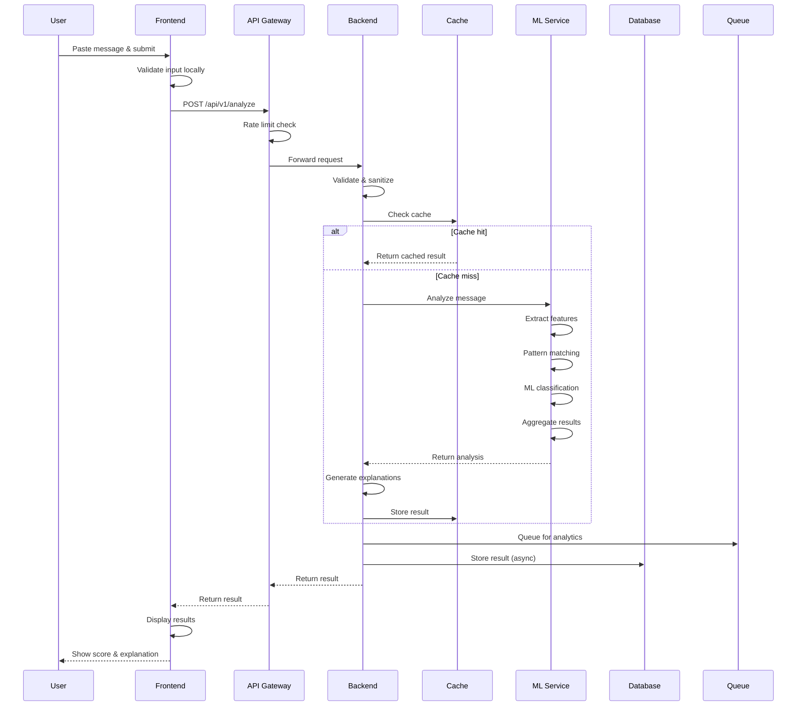
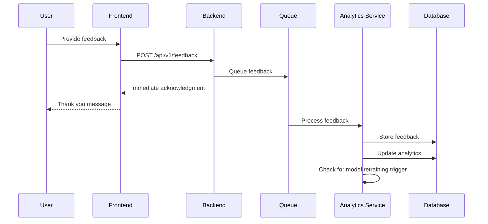
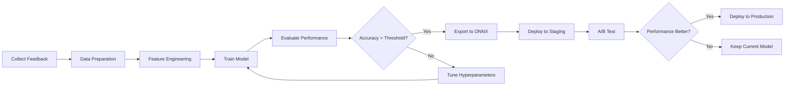
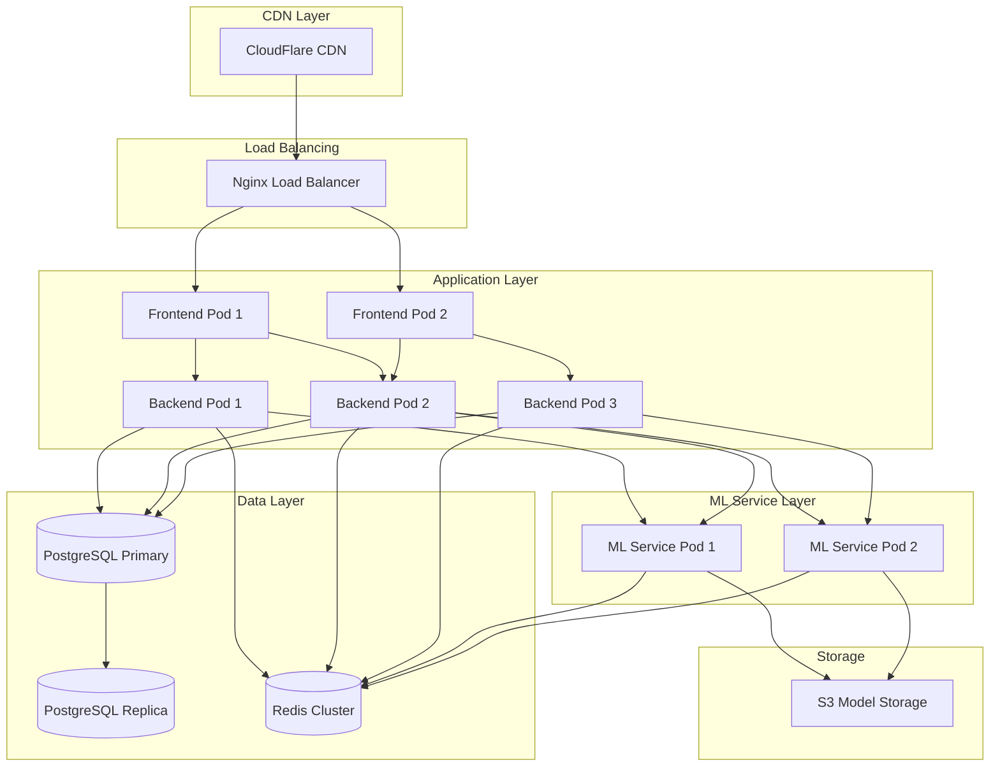

# Design Document: AI Fake Job & Loan Scam Detector

## Overview

The AI Fake Job & Loan Scam Detector is a web-based application that analyzes suspicious messages and provides users with scam probability scores and detailed explanations. The system is designed to be accessible to users in tier-2 and tier-3 cities with varying levels of technical literacy and internet connectivity.

The architecture follows a three-tier model:
- **Frontend**: Responsive web interface optimized for mobile devices
- **Backend**: Flask-based REST API handling business logic and orchestration
- **AI Model**: NLP-based machine learning model for scam detection

The system prioritizes simplicity, speed, and educational value, helping users not only detect scams but also learn to identify them independently.

## Architecture

### High-Level Architecture



### Component Architecture

The system consists of the following major components:

1. **Frontend Layer**
   - Responsive web application
   - Progressive Web App (PWA) capabilities for offline access
   - Multi-language support
   - Optimized for low-bandwidth connections

2. **API Gateway**
   - Request routing and load balancing
   - Rate limiting and throttling
   - API key authentication for external integrations
   - Request/response logging

3. **Backend Services**
   - Message validation and preprocessing
   - Business logic orchestration
   - Result formatting and explanation generation
   - Feedback collection and storage

4. **ML Model Service**
   - Scam pattern detection
   - Probability score calculation
   - Feature extraction from messages
   - Model versioning and A/B testing

5. **Data Layer**
   - PostgreSQL for structured data (feedback, analytics)
   - Redis for caching frequent patterns and results
   - Model storage for ML artifacts

6. **Analytics Service**
   - Asynchronous processing of detection results
   - Model performance monitoring
   - User feedback analysis
   - Scam trend identification

## Components and Interfaces

### Frontend Component

**Technology**: React.js with TypeScript, Tailwind CSS

**Key Modules**:

1. **MessageInputForm**
   - Accepts user message input (max 5000 characters)
   - Validates input before submission
   - Displays character count and validation errors
   - Interface:
     ```typescript
     interface MessageInputProps {
       onSubmit: (message: string) => Promise<void>;
       maxLength: number;
       placeholder: string;
     }
     ```

2. **ResultsDisplay**
   - Shows scam probability score as percentage
   - Displays risk level with color coding (green/yellow/red)
   - Renders explanation points in user's language
   - Interface:
     ```typescript
     interface AnalysisResult {
       score: number;
       riskLevel: 'low' | 'medium' | 'high';
       indicators: ScamIndicator[];
       explanation: string[];
       language: string;
     }
     ```

3. **LanguageSelector**
   - Allows users to select preferred language
   - Persists selection in local storage
   - Triggers UI re-render on language change

4. **FeedbackWidget**
   - Collects user feedback on detection accuracy
   - Simple thumbs up/down interface
   - Optional comment field

5. **EducationalPanel**
   - Displays scam awareness tips
   - Shows common scam patterns
   - Provides guidance on reporting scams

**API Communication**:
```typescript
interface APIClient {
  analyzeMessage(message: string, language: string): Promise<AnalysisResult>;
  submitFeedback(resultId: string, accurate: boolean, comment?: string): Promise<void>;
  getEducationalContent(language: string): Promise<EducationalContent>;
}
```

### Backend Component

**Technology**: Python 3.11, Flask 3.0, Gunicorn

**Key Modules**:

1. **MessageValidator**
   - Validates message length and content
   - Sanitizes input to prevent injection attacks
   - Checks for empty or whitespace-only messages
   - Interface:
     ```python
     class MessageValidator:
         def validate(self, message: str) -> ValidationResult:
             """Validates message and returns result with errors if any"""
             pass
         
         def sanitize(self, message: str) -> str:
             """Removes potentially harmful content"""
             pass
     ```

2. **AnalysisOrchestrator**
   - Coordinates the analysis workflow
   - Calls ML model service
   - Generates explanations from model output
   - Formats results for frontend
   - Interface:
     ```python
     class AnalysisOrchestrator:
         def analyze(self, message: str, language: str) -> AnalysisResult:
             """Orchestrates full analysis pipeline"""
             pass
     ```

3. **ExplanationGenerator**
   - Converts model predictions into human-readable explanations
   - Translates explanations to user's preferred language
   - Prioritizes most significant scam indicators
   - Interface:
     ```python
     class ExplanationGenerator:
         def generate(self, indicators: List[ScamIndicator], 
                     language: str) -> List[str]:
             """Generates explanations from detected indicators"""
             pass
     ```

4. **FeedbackCollector**
   - Stores user feedback asynchronously
   - Queues feedback for analysis service
   - Returns immediate acknowledgment to user
   - Interface:
     ```python
     class FeedbackCollector:
         def collect(self, result_id: str, accurate: bool, 
                    comment: Optional[str]) -> None:
             """Collects and queues user feedback"""
             pass
     ```

5. **CacheManager**
   - Caches common scam patterns
   - Stores recent analysis results
   - Implements TTL-based expiration
   - Interface:
     ```python
     class CacheManager:
         def get(self, key: str) -> Optional[Any]:
             """Retrieves cached value"""
             pass
         
         def set(self, key: str, value: Any, ttl: int) -> None:
             """Stores value with expiration"""
             pass
     ```

**REST API Endpoints**:

```python
POST /api/v1/analyze
Request:
{
  "message": "string",
  "language": "en|hi|ta|te|..."
}
Response:
{
  "result_id": "uuid",
  "score": 0.85,
  "risk_level": "high",
  "indicators": [
    {
      "type": "urgent_language",
      "confidence": 0.92,
      "text_snippet": "Act now or lose this opportunity"
    }
  ],
  "explanations": [
    "The message uses urgent language to pressure you into quick action",
    "Requests for personal banking information detected"
  ],
  "timestamp": "2024-01-15T10:30:00Z"
}

POST /api/v1/feedback
Request:
{
  "result_id": "uuid",
  "accurate": true,
  "comment": "optional string"
}
Response:
{
  "status": "success",
  "message": "Thank you for your feedback"
}

GET /api/v1/education?language=en
Response:
{
  "tips": ["string"],
  "common_patterns": ["string"],
  "reporting_guidance": "string"
}
```

### AI Model Component

**Technology**: Python 3.11, scikit-learn, transformers (BERT-based), ONNX Runtime

**Architecture**: Ensemble model combining multiple detection strategies

**Key Modules**:

1. **FeatureExtractor**
   - Extracts linguistic features from messages
   - Identifies keywords and phrases
   - Analyzes message structure and formatting
   - Interface:
     ```python
     class FeatureExtractor:
         def extract(self, message: str) -> FeatureVector:
             """Extracts features for model input"""
             pass
     ```

2. **PatternMatcher**
   - Rule-based detection for known scam patterns
   - Regular expressions for phone numbers, URLs, keywords
   - Maintains pattern database
   - Interface:
     ```python
     class PatternMatcher:
         def match(self, message: str) -> List[PatternMatch]:
             """Finds matching scam patterns"""
             pass
     ```

3. **MLClassifier**
   - BERT-based transformer model for semantic understanding
   - Fine-tuned on Indian scam message dataset
   - Outputs probability scores for scam categories
   - Interface:
     ```python
     class MLClassifier:
         def predict(self, features: FeatureVector) -> Prediction:
             """Predicts scam probability and categories"""
             pass
         
         def predict_proba(self, features: FeatureVector) -> np.ndarray:
             """Returns probability distribution"""
             pass
     ```

4. **EnsembleAggregator**
   - Combines outputs from pattern matcher and ML classifier
   - Weighted voting based on confidence scores
   - Produces final scam probability score
   - Interface:
     ```python
     class EnsembleAggregator:
         def aggregate(self, pattern_results: List[PatternMatch],
                      ml_prediction: Prediction) -> AggregatedResult:
             """Combines multiple detection signals"""
             pass
     ```

5. **IndicatorExtractor**
   - Identifies specific scam indicators from model outputs
   - Extracts relevant text snippets
   - Ranks indicators by importance
   - Interface:
     ```python
     class IndicatorExtractor:
         def extract(self, message: str, 
                    aggregated_result: AggregatedResult) -> List[ScamIndicator]:
             """Extracts and ranks scam indicators"""
             pass
     ```

**Model Training Pipeline**:

```python
class ModelTrainer:
    def prepare_data(self, raw_messages: List[str], 
                    labels: List[int]) -> Dataset:
        """Preprocesses and splits data"""
        pass
    
    def train(self, dataset: Dataset, 
             hyperparameters: Dict) -> TrainedModel:
        """Trains the model"""
        pass
    
    def evaluate(self, model: TrainedModel, 
                test_data: Dataset) -> Metrics:
        """Evaluates model performance"""
        pass
    
    def export(self, model: TrainedModel, 
              path: str) -> None:
        """Exports model in ONNX format"""
        pass
```

**Scam Categories Detected**:
- Fake job offers
- Loan scams
- Phishing attempts
- Prize/lottery scams
- Investment fraud
- Impersonation scams
- OTP/banking information requests

## Data Models

### Core Data Structures

```python
from dataclasses import dataclass
from typing import List, Optional
from datetime import datetime
from enum import Enum

class RiskLevel(Enum):
    LOW = "low"
    MEDIUM = "medium"
    HIGH = "high"

class IndicatorType(Enum):
    URGENT_LANGUAGE = "urgent_language"
    PERSONAL_INFO_REQUEST = "personal_info_request"
    UNREALISTIC_PROMISES = "unrealistic_promises"
    SUSPICIOUS_LINKS = "suspicious_links"
    IMPERSONATION = "impersonation"
    GRAMMAR_ERRORS = "grammar_errors"
    PRESSURE_TACTICS = "pressure_tactics"

@dataclass
class ScamIndicator:
    type: IndicatorType
    confidence: float
    text_snippet: str
    description: str

@dataclass
class AnalysisResult:
    result_id: str
    score: float
    risk_level: RiskLevel
    indicators: List[ScamIndicator]
    explanations: List[str]
    language: str
    timestamp: datetime
    processing_time_ms: int

@dataclass
class ValidationResult:
    is_valid: bool
    errors: List[str]
    sanitized_message: Optional[str]

@dataclass
class FeatureVector:
    text_features: dict
    structural_features: dict
    linguistic_features: dict

@dataclass
class Prediction:
    scam_probability: float
    category_probabilities: dict
    confidence: float

@dataclass
class PatternMatch:
    pattern_id: str
    pattern_type: IndicatorType
    confidence: float
    matched_text: str
    position: tuple

@dataclass
class AggregatedResult:
    final_score: float
    pattern_matches: List[PatternMatch]
    ml_prediction: Prediction
    combined_confidence: float

@dataclass
class UserFeedback:
    feedback_id: str
    result_id: str
    accurate: bool
    comment: Optional[str]
    timestamp: datetime
    user_agent: str
```

### Database Schema

```sql
-- Analysis results for analytics
CREATE TABLE analysis_results (
    result_id UUID PRIMARY KEY,
    message_hash VARCHAR(64) NOT NULL,  -- SHA-256 hash for deduplication
    score DECIMAL(3,2) NOT NULL,
    risk_level VARCHAR(10) NOT NULL,
    indicators JSONB NOT NULL,
    language VARCHAR(10) NOT NULL,
    processing_time_ms INTEGER NOT NULL,
    created_at TIMESTAMP NOT NULL DEFAULT NOW(),
    INDEX idx_created_at (created_at),
    INDEX idx_risk_level (risk_level),
    INDEX idx_score (score)
);

-- User feedback
CREATE TABLE user_feedback (
    feedback_id UUID PRIMARY KEY,
    result_id UUID NOT NULL REFERENCES analysis_results(result_id),
    accurate BOOLEAN NOT NULL,
    comment TEXT,
    user_agent TEXT,
    created_at TIMESTAMP NOT NULL DEFAULT NOW(),
    INDEX idx_result_id (result_id),
    INDEX idx_created_at (created_at)
);

-- Scam patterns (for rule-based detection)
CREATE TABLE scam_patterns (
    pattern_id UUID PRIMARY KEY,
    pattern_type VARCHAR(50) NOT NULL,
    pattern_regex TEXT NOT NULL,
    keywords TEXT[],
    confidence_weight DECIMAL(3,2) NOT NULL,
    language VARCHAR(10) NOT NULL,
    active BOOLEAN NOT NULL DEFAULT TRUE,
    created_at TIMESTAMP NOT NULL DEFAULT NOW(),
    updated_at TIMESTAMP NOT NULL DEFAULT NOW(),
    INDEX idx_pattern_type (pattern_type),
    INDEX idx_language (language),
    INDEX idx_active (active)
);

-- Model versions for A/B testing
CREATE TABLE model_versions (
    version_id UUID PRIMARY KEY,
    version_name VARCHAR(50) NOT NULL UNIQUE,
    model_path TEXT NOT NULL,
    accuracy DECIMAL(5,4),
    precision DECIMAL(5,4),
    recall DECIMAL(5,4),
    f1_score DECIMAL(5,4),
    active BOOLEAN NOT NULL DEFAULT FALSE,
    traffic_percentage INTEGER DEFAULT 0,
    created_at TIMESTAMP NOT NULL DEFAULT NOW(),
    INDEX idx_active (active)
);

-- Analytics aggregations
CREATE TABLE daily_analytics (
    date DATE PRIMARY KEY,
    total_analyses INTEGER NOT NULL,
    high_risk_count INTEGER NOT NULL,
    medium_risk_count INTEGER NOT NULL,
    low_risk_count INTEGER NOT NULL,
    avg_score DECIMAL(3,2) NOT NULL,
    avg_processing_time_ms INTEGER NOT NULL,
    feedback_count INTEGER NOT NULL,
    accuracy_rate DECIMAL(5,4),
    created_at TIMESTAMP NOT NULL DEFAULT NOW()
);
```

## Data Flow

### Message Analysis Flow



### Feedback Collection Flow



### Model Training Flow



## Technology Stack

### Frontend
- **Framework**: React 18 with TypeScript
- **Styling**: Tailwind CSS 3.x
- **State Management**: React Context API + React Query
- **HTTP Client**: Axios
- **Internationalization**: i18next
- **Build Tool**: Vite
- **PWA**: Workbox for service workers
- **Testing**: Jest + React Testing Library

### Backend
- **Language**: Python 3.11
- **Web Framework**: Flask 3.0
- **WSGI Server**: Gunicorn with gevent workers
- **API Documentation**: Flask-RESTX (Swagger)
- **Validation**: Marshmallow
- **Authentication**: Flask-JWT-Extended (for API keys)
- **Rate Limiting**: Flask-Limiter with Redis backend
- **Task Queue**: Celery with Redis broker
- **Testing**: pytest + pytest-flask

### ML/AI
- **ML Framework**: scikit-learn 1.3
- **Deep Learning**: transformers (Hugging Face)
- **Model**: IndicBERT (BERT for Indian languages)
- **Runtime**: ONNX Runtime for inference
- **Feature Engineering**: pandas, numpy
- **Model Tracking**: MLflow
- **Training**: PyTorch 2.0

### Data Layer
- **Primary Database**: PostgreSQL 15
- **Cache**: Redis 7.x
- **Object Storage**: AWS S3 (for model artifacts)
- **Message Queue**: Redis (Celery broker)

### Infrastructure
- **Container**: Docker
- **Orchestration**: Kubernetes
- **Load Balancer**: Nginx
- **API Gateway**: Kong or AWS API Gateway
- **Monitoring**: Prometheus + Grafana
- **Logging**: ELK Stack (Elasticsearch, Logstash, Kibana)
- **Error Tracking**: Sentry

### DevOps
- **CI/CD**: GitHub Actions
- **Infrastructure as Code**: Terraform
- **Configuration Management**: Ansible
- **Container Registry**: Docker Hub or AWS ECR

## Deployment Architecture

### Production Environment



### Deployment Strategy

**Blue-Green Deployment**:
- Maintain two identical production environments (Blue and Green)
- Deploy new version to inactive environment
- Run smoke tests and health checks
- Switch traffic to new environment
- Keep old environment for quick rollback

**Kubernetes Configuration**:

```yaml
# Backend Deployment
apiVersion: apps/v1
kind: Deployment
metadata:
  name: scam-detector-backend
spec:
  replicas: 3
  selector:
    matchLabels:
      app: scam-detector-backend
  template:
    metadata:
      labels:
        app: scam-detector-backend
    spec:
      containers:
      - name: backend
        image: scam-detector-backend:latest
        ports:
        - containerPort: 5000
        env:
        - name: DATABASE_URL
          valueFrom:
            secretKeyRef:
              name: db-credentials
              key: url
        - name: REDIS_URL
          valueFrom:
            configMapKeyRef:
              name: redis-config
              key: url
        resources:
          requests:
            memory: "512Mi"
            cpu: "500m"
          limits:
            memory: "1Gi"
            cpu: "1000m"
        livenessProbe:
          httpGet:
            path: /health
            port: 5000
          initialDelaySeconds: 30
          periodSeconds: 10
        readinessProbe:
          httpGet:
            path: /ready
            port: 5000
          initialDelaySeconds: 5
          periodSeconds: 5

---
# ML Service Deployment
apiVersion: apps/v1
kind: Deployment
metadata:
  name: scam-detector-ml
spec:
  replicas: 2
  selector:
    matchLabels:
      app: scam-detector-ml
  template:
    metadata:
      labels:
        app: scam-detector-ml
    spec:
      containers:
      - name: ml-service
        image: scam-detector-ml:latest
        ports:
        - containerPort: 8000
        env:
        - name: MODEL_PATH
          value: "/models/current"
        - name: REDIS_URL
          valueFrom:
            configMapKeyRef:
              name: redis-config
              key: url
        resources:
          requests:
            memory: "2Gi"
            cpu: "1000m"
          limits:
            memory: "4Gi"
            cpu: "2000m"
        volumeMounts:
        - name: model-storage
          mountPath: /models
      volumes:
      - name: model-storage
        persistentVolumeClaim:
          claimName: ml-model-pvc
```

### Environment Configuration

**Development**:
- Single instance of each service
- SQLite for database (optional)
- Local Redis
- Mock ML model for fast iteration

**Staging**:
- Mirrors production architecture at smaller scale
- 1 replica per service
- Shared PostgreSQL instance
- Real ML model
- Used for integration testing and QA

**Production**:
- Multiple replicas for high availability
- Dedicated PostgreSQL with replication
- Redis cluster
- CDN for static assets
- Auto-scaling enabled

## Scalability Plan

### Horizontal Scaling

**Application Layer**:
- Backend and ML services are stateless
- Can scale horizontally by adding more pods
- Kubernetes Horizontal Pod Autoscaler (HPA) based on:
  - CPU utilization > 70%
  - Memory utilization > 80%
  - Request queue length > 100

```yaml
apiVersion: autoscaling/v2
kind: HorizontalPodAutoscaler
metadata:
  name: backend-hpa
spec:
  scaleTargetRef:
    apiVersion: apps/v1
    kind: Deployment
    name: scam-detector-backend
  minReplicas: 3
  maxReplicas: 10
  metrics:
  - type: Resource
    resource:
      name: cpu
      target:
        type: Utilization
        averageUtilization: 70
  - type: Resource
    resource:
      name: memory
      target:
        type: Utilization
        averageUtilization: 80
```

**Database Layer**:
- PostgreSQL read replicas for analytics queries
- Connection pooling (PgBouncer)
- Partitioning for large tables (by date)
- Archival strategy for old data

**Cache Layer**:
- Redis cluster with sharding
- Separate cache instances for:
  - Analysis results (TTL: 1 hour)
  - Scam patterns (TTL: 24 hours)
  - Session data (TTL: 30 minutes)

### Vertical Scaling

**ML Service**:
- GPU instances for model inference (if needed)
- Larger memory allocation for model loading
- CPU optimization for ONNX runtime

### Performance Optimization

**Caching Strategy**:
1. **L1 Cache** (Application memory): Recent results (100 items, LRU)
2. **L2 Cache** (Redis): Frequent patterns and results (1 hour TTL)
3. **L3 Cache** (CDN): Static assets and educational content

**Database Optimization**:
- Indexes on frequently queried columns
- Materialized views for analytics
- Query optimization and EXPLAIN analysis
- Connection pooling

**ML Model Optimization**:
- Model quantization (INT8) for faster inference
- ONNX runtime for optimized execution
- Batch processing for multiple requests
- Model caching in memory

**API Optimization**:
- Response compression (gzip)
- Pagination for list endpoints
- Field filtering (sparse fieldsets)
- ETags for conditional requests

### Load Testing Targets

**Performance Benchmarks**:
- 1000 requests per second sustained
- 95th percentile response time < 3 seconds
- 99th percentile response time < 5 seconds
- 99.9% uptime SLA

**Capacity Planning**:
- Expected daily users: 100,000
- Peak concurrent users: 5,000
- Average message length: 500 characters
- Cache hit rate target: 70%

### Monitoring and Alerting

**Key Metrics**:
- Request rate and response times
- Error rates (4xx, 5xx)
- ML model inference time
- Cache hit/miss ratio
- Database query performance
- Queue length and processing time

**Alerts**:
- Response time > 5 seconds for 5 minutes
- Error rate > 5% for 2 minutes
- CPU utilization > 90% for 5 minutes
- Database connection pool exhausted
- ML service unavailable
- Cache cluster degraded

**Dashboards**:
- Real-time request metrics
- Model performance metrics
- Infrastructure health
- Business metrics (scam detection rates)


## Correctness Properties

A property is a characteristic or behavior that should hold true across all valid executions of a system—essentially, a formal statement about what the system should do. Properties serve as the bridge between human-readable specifications and machine-verifiable correctness guarantees.

### Input Validation Properties

**Property 1: Valid message length acceptance**
*For any* message with length between 1 and 5000 characters (excluding whitespace-only), the System should accept it for analysis and return a valid result.
**Validates: Requirements 1.1**

**Property 2: Whitespace-only rejection**
*For any* string composed entirely of whitespace characters, the System should reject it and return an error message.
**Validates: Requirements 1.3**

**Property 3: Message formatting preservation**
*For any* message containing formatting characters (newlines, tabs, multiple spaces), the System should preserve the exact formatting in the analysis process.
**Validates: Requirements 1.4**

**Property 4: Response time bound**
*For any* valid message, the System should return analysis results within 5 seconds.
**Validates: Requirements 1.5**

### Scoring and Classification Properties

**Property 5: Score bounds**
*For any* valid message analyzed, the Scam_Probability_Score should be a value between 0.0 and 1.0 inclusive.
**Validates: Requirements 2.1**

**Property 6: Risk classification consistency**
*For any* Scam_Probability_Score, the risk level classification should be: "Low Risk" for [0.0, 0.3), "Medium Risk" for [0.3, 0.7), and "High Risk" for [0.7, 1.0].
**Validates: Requirements 2.2, 2.3, 2.4**

### Explanation Generation Properties

**Property 7: Explanation list generation**
*For any* analyzed message, the Explanation_Generator should return a list of Scam_Indicators (which may be empty for legitimate messages).
**Validates: Requirements 3.1**

**Property 8: High-risk explanation requirement**
*For any* message with Scam_Probability_Score above 0.3, the System should provide at least one explanation point.
**Validates: Requirements 3.4**

**Property 9: Language-matched explanations**
*For any* message analyzed with a specified language preference, all explanations should be generated in that same language.
**Validates: Requirements 3.5**

### Pattern Recognition Properties

**Property 10: Urgent language detection**
*For any* message containing urgent language patterns (e.g., "act now", "limited time", "immediate action required"), the Analysis_Engine should flag it as a Scam_Indicator of type URGENT_LANGUAGE.
**Validates: Requirements 4.1**

**Property 11: Personal information request detection**
*For any* message requesting personal information (bank details, OTP, password, SSN, Aadhaar), the Analysis_Engine should flag it as a Scam_Indicator of type PERSONAL_INFO_REQUEST.
**Validates: Requirements 4.2**

**Property 12: Unrealistic promises detection**
*For any* message promising unrealistic returns or benefits (e.g., "guaranteed 500% returns", "earn ₹50,000 daily"), the Analysis_Engine should flag it as a Scam_Indicator of type UNREALISTIC_PROMISES.
**Validates: Requirements 4.3**

**Property 13: Suspicious link detection**
*For any* message containing URLs with suspicious patterns (shortened URLs, misspelled domains, unusual TLDs), the Analysis_Engine should flag it as a Scam_Indicator of type SUSPICIOUS_LINKS.
**Validates: Requirements 4.4**

**Property 14: Impersonation detection**
*For any* message claiming to be from legitimate organizations (banks, government agencies) without proper verification markers, the Analysis_Engine should flag it as a Scam_Indicator of type IMPERSONATION.
**Validates: Requirements 4.5**

**Property 15: Grammar error detection**
*For any* message containing grammatical errors typical of scam messages (poor punctuation, capitalization errors, awkward phrasing), the Analysis_Engine should flag it as a Scam_Indicator of type GRAMMAR_ERRORS.
**Validates: Requirements 4.6**

### User Interface Properties

**Property 16: Score percentage formatting**
*For any* Scam_Probability_Score displayed to users, it should be formatted as a percentage with appropriate precision (e.g., 0.85 → "85%").
**Validates: Requirements 5.3**

### Privacy and Security Properties

**Property 17: PII non-storage**
*For any* message containing personally identifiable information (names, phone numbers, email addresses, bank details), the System should not store this information in persistent storage after analysis completes.
**Validates: Requirements 6.1**

**Property 18: Message content non-retention**
*For any* message analyzed, the original message content should not be retained in the database after the analysis session ends (only anonymized hashes for deduplication).
**Validates: Requirements 6.2**

### Multi-language Properties

**Property 19: Multi-language message processing**
*For any* message in English, Hindi, or supported regional Indian languages, the System should successfully process and analyze it without errors.
**Validates: Requirements 8.1**

**Property 20: UI language consistency**
*For any* selected language preference, all user interface elements (labels, buttons, messages) should be displayed in that language.
**Validates: Requirements 8.2**

**Property 21: Language detection accuracy**
*For any* message in a known supported language, the System should correctly detect the language with reasonable accuracy.
**Validates: Requirements 8.4**

**Property 22: Mixed-language handling**
*For any* message containing text in multiple languages, the System should analyze it without throwing errors and return a valid result.
**Validates: Requirements 8.5**

### API Properties

**Property 23: API authentication enforcement**
*For any* API request without a valid API key, the System should reject it with HTTP 401 Unauthorized status.
**Validates: Requirements 10.2**

**Property 24: JSON response format**
*For any* valid API request, the System should return results in valid JSON format that can be parsed without errors.
**Validates: Requirements 10.3**

**Property 25: API backward compatibility**
*For any* valid API request using a previous API version, the System should continue to process it correctly after model updates.
**Validates: Requirements 11.2**

### Logging and Feedback Properties

**Property 26: Detection result logging**
*For any* message analyzed, the System should log the detection result (score, risk level, timestamp) for analytics purposes.
**Validates: Requirements 11.3**

**Property 27: Feedback recording**
*For any* user feedback submitted (accurate/inaccurate), the System should record it with the associated result_id for future analysis.
**Validates: Requirements 12.2**

**Property 28: False positive flagging**
*For any* feedback indicating a false positive (user marks high-risk message as inaccurate), the System should flag the case for administrator review.
**Validates: Requirements 12.4**

## Error Handling

### Error Categories

**Validation Errors**:
- Empty message submission → HTTP 400 with message "Message cannot be empty"
- Message exceeds 5000 characters → HTTP 400 with message "Message too long (max 5000 characters)"
- Whitespace-only message → HTTP 400 with message "Message cannot contain only whitespace"
- Invalid language code → HTTP 400 with message "Unsupported language"

**Authentication Errors**:
- Missing API key → HTTP 401 with message "API key required"
- Invalid API key → HTTP 401 with message "Invalid API key"
- Expired API key → HTTP 401 with message "API key expired"

**Rate Limiting Errors**:
- Rate limit exceeded → HTTP 429 with message "Rate limit exceeded. Please try again in X seconds"
- Include Retry-After header with seconds until reset

**Service Errors**:
- ML model unavailable → HTTP 503 with message "Analysis service temporarily unavailable. Please try again."
- Database connection failure → HTTP 503 with message "Service temporarily unavailable"
- Timeout during analysis → HTTP 504 with message "Analysis timed out. Please try again with a shorter message."

**Internal Errors**:
- Unexpected exceptions → HTTP 500 with message "An unexpected error occurred. Please try again."
- Log full stack trace for debugging
- Do not expose internal details to users

### Error Response Format

```json
{
  "error": {
    "code": "VALIDATION_ERROR",
    "message": "Message cannot be empty",
    "details": {
      "field": "message",
      "constraint": "non_empty"
    },
    "timestamp": "2024-01-15T10:30:00Z",
    "request_id": "uuid"
  }
}
```

### Retry Strategy

**Client-Side Retries**:
- Retry on 503 and 504 errors
- Exponential backoff: 1s, 2s, 4s
- Maximum 3 retry attempts
- Do not retry on 4xx errors (except 429)

**Server-Side Circuit Breaker**:
- Open circuit after 5 consecutive ML service failures
- Half-open state after 30 seconds
- Close circuit after 2 successful requests

### Graceful Degradation

**ML Service Unavailable**:
- Fall back to rule-based pattern matching only
- Return results with lower confidence
- Display notice: "Analysis using basic detection (advanced AI temporarily unavailable)"

**Database Unavailable**:
- Continue processing requests (analysis still works)
- Skip logging and feedback storage
- Queue operations for retry when database recovers

**Cache Unavailable**:
- Continue without caching
- May result in slower response times
- All functionality remains operational

## Testing Strategy

### Dual Testing Approach

The system will employ both unit testing and property-based testing to ensure comprehensive coverage:

**Unit Tests**: Focus on specific examples, edge cases, and error conditions
- Concrete examples of scam messages and legitimate messages
- Boundary conditions (0 characters, 5000 characters, 5001 characters)
- Error handling scenarios
- Integration points between components
- Mock external dependencies (database, cache, ML model)

**Property-Based Tests**: Verify universal properties across all inputs
- Generate random messages of varying lengths and content
- Test properties hold for large input spaces (100+ iterations per property)
- Catch edge cases that manual test writing might miss
- Validate invariants and contracts

Both approaches are complementary and necessary for high confidence in system correctness.

### Property-Based Testing Configuration

**Framework**: Hypothesis (Python)

**Configuration**:
- Minimum 100 iterations per property test
- Deadline: 5 seconds per test case
- Shrinking enabled to find minimal failing examples
- Database: Save failing examples for regression testing

**Test Tagging**: Each property test must include a comment referencing the design property:
```python
# Feature: scam-detector, Property 1: Valid message length acceptance
@given(st.text(min_size=1, max_size=5000).filter(lambda s: not s.isspace()))
def test_valid_message_acceptance(message):
    result = analyze_message(message)
    assert result is not None
    assert 0.0 <= result.score <= 1.0
```

### Unit Testing Strategy

**Test Organization**:
- `tests/unit/` - Unit tests for individual components
- `tests/integration/` - Integration tests for component interactions
- `tests/property/` - Property-based tests
- `tests/e2e/` - End-to-end API tests

**Coverage Targets**:
- Line coverage: 85% minimum
- Branch coverage: 80% minimum
- Critical paths: 100% coverage

**Key Test Suites**:

1. **Message Validation Tests**
   - Empty message rejection
   - Whitespace-only rejection
   - Length boundary tests (0, 1, 5000, 5001 characters)
   - Special character handling
   - Unicode and emoji handling

2. **Scam Detection Tests**
   - Known scam message examples (job scams, loan scams, phishing)
   - Known legitimate message examples
   - Boundary cases for each scam indicator type
   - Mixed indicator messages
   - Multilingual scam messages

3. **Scoring and Classification Tests**
   - Score boundary tests (0.0, 0.3, 0.7, 1.0)
   - Risk level classification for each range
   - Score consistency across multiple runs

4. **Explanation Generation Tests**
   - Explanations for high-risk messages
   - Explanations for low-risk messages
   - Language-specific explanations
   - Indicator-to-explanation mapping

5. **API Tests**
   - Authentication success and failure
   - Rate limiting behavior
   - Request/response format validation
   - Error response formats
   - API versioning

6. **Performance Tests**
   - Response time under normal load
   - Response time under high load
   - Concurrent request handling
   - Cache effectiveness

### Integration Testing

**Database Integration**:
- Test data persistence and retrieval
- Test transaction handling
- Test connection pooling

**Cache Integration**:
- Test cache hit/miss scenarios
- Test cache invalidation
- Test cache fallback when unavailable

**ML Model Integration**:
- Test model loading and initialization
- Test inference with various inputs
- Test model fallback when unavailable
- Test model version switching

### End-to-End Testing

**User Workflows**:
1. Submit message → View results → Provide feedback
2. Submit message in Hindi → View Hindi explanations
3. Submit multiple messages → Verify rate limiting
4. API integration workflow

**Test Data**:
- Curated dataset of 100+ real scam messages
- Curated dataset of 100+ legitimate messages
- Messages in multiple languages
- Edge cases and adversarial examples

### Continuous Testing

**CI/CD Pipeline**:
1. Run unit tests on every commit
2. Run property tests on every pull request
3. Run integration tests before deployment
4. Run E2E tests in staging environment
5. Run performance tests weekly

**Monitoring in Production**:
- Track model accuracy metrics
- Monitor false positive/negative rates
- Alert on accuracy degradation
- A/B test model improvements

### Test Data Management

**Synthetic Data Generation**:
- Generate scam messages using templates
- Generate legitimate messages from public datasets
- Ensure diverse language representation
- Include regional language variations

**Real Data Collection**:
- Collect anonymized feedback from production
- Build test dataset from user-reported scams
- Quarterly dataset refresh with new scam patterns
- Maintain separate train/test/validation splits

**Data Privacy**:
- Remove all PII from test datasets
- Use synthetic PII for testing
- Encrypt test data at rest
- Limit access to test data containing real examples
